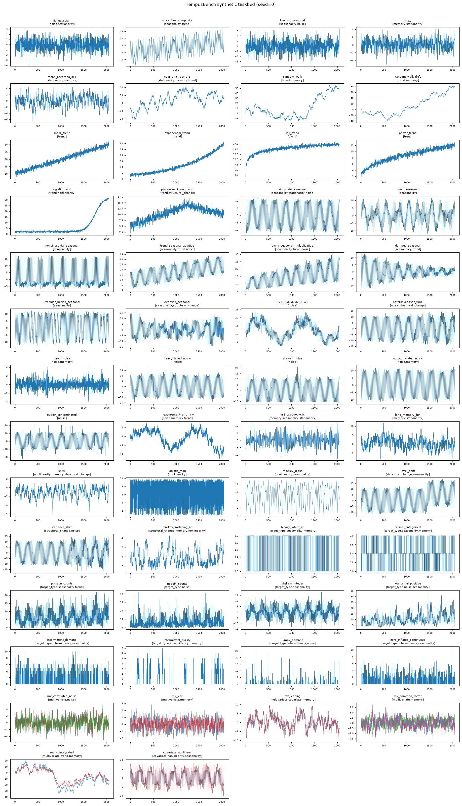
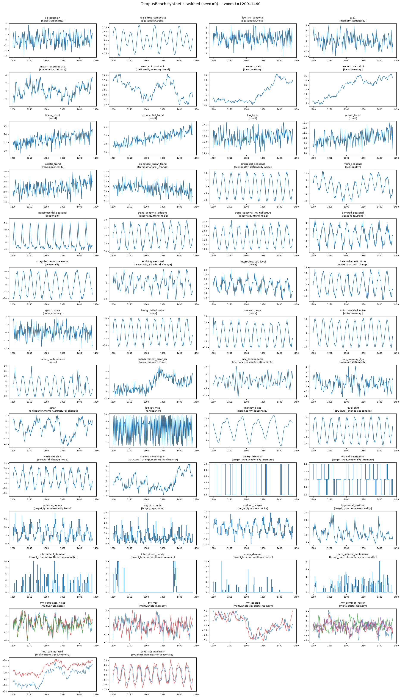

# TempusBench Synthetic Taskbed

This document specifies the **synthetic task catalog** of TempusBench: the category
taxonomy, the 54 benchmark tasks, and the exact mathematics of every data-generating
process (DGP). The companion implementation is [`synthetic_generators.py`](synthetic_generators.py),
whose `TASKS` registry mirrors this document one-to-one.

Notation: $t = 0, 1, \dots, T-1$ with default $T = 2048$; $\varepsilon_t, \nu_t, w_t \sim \mathcal N(0,1)$ i.i.d.
unless stated otherwise; $P = 24$ is the base seasonal period (an "hourly/daily" analogue) and
$168 = 7 \times 24$ the long period. $\sigma(\cdot)$ names a noise scale, $\mathbb 1\{\cdot\}$ an indicator.

---

## 1. Design principles

1. **One property per task.** Each task perturbs exactly one property against a fixed
   neutral baseline (common length $T$, signal amplitude $\approx 10$, noise sd $\approx 1$,
   period $P=24$). Category-level aggregates (win rate, skill score per category) are then
   interpretable as sensitivity to that property, not to incidental scale or length differences.
2. **Multi-category tagging.** A task exercises every category it is tagged with (e.g., a
   sinusoid is both *Seasonality* and *Stationarity*); the category YAML files may therefore
   list the same task under several categories.
3. **Known Bayes forecast.** Because the DGP is known, the optimal (Bayes) forecast and its
   irreducible error are computable for nearly every task. Model error can be decomposed into
   irreducible + excess error; per-task notes below state the Bayes forecast where instructive.
4. **Controls against hallucinated structure.** The catalog contains tasks whose *correct*
   behavior is to predict nothing (white noise), to stop predicting beyond a known lag (MA(1)),
   or to output a flat martingale forecast (random walk). A benchmark composed only of
   structured tasks cannot detect models that invent structure.
5. **Diagnostic pairs.** Several tasks are deliberate minimal contrasts: linear trend vs.
   random walk with drift (trend- vs. difference-stationarity), Poisson vs. negative binomial
   (equi- vs. overdispersion), additive vs. multiplicative composition, level shift vs.
   variance shift. Comparing a model across a pair isolates the single contrasted property.
6. **Reproducible and refreshable.** All randomness flows through one seeded
   `numpy.random.Generator`. Fixed seeds give a frozen benchmark; re-drawing seeds implements
   the paper's planned *dynamic* synthetic benchmarks with contamination-free test data.

**Scope notes.** (i) Synthetic series are index-based; calendar *frequency* is an application-taskbed
axis (synthetic CSVs may stamp arbitrary regular timestamps, e.g. hourly from 2000-01-01, to fit the
dataset schema). (ii) Context length and forecast horizon are task-YAML parameters, not DGP
parameters; recommended default split is context 512 / horizon 64 with rolling windows.
Task-specific caveats (e.g., lead–lag horizon) are noted below. (iii) Missing-data handling is an
evaluation-pipeline concern (`handle_missing`); generators emit complete series.

---

## 2. Category taxonomy

| # | Category (tag) | Property tested | Failure mode it exposes | # tasks |
|---|---|---|---|---|
| 1 | **Stationarity** (`stationarity`) | Mean reversion, constancy of distribution over time | Treating stationary data as trending, or over-differencing | 7 |
| 2 | **Trend / Movement** (`trend`) | Deterministic trend shapes (linear, exp, log, power, sigmoid, broken) and stochastic trends (unit roots) | Wrong extrapolation curvature; confusing trend- with difference-stationarity | 16 |
| 3 | **Seasonality** (`seasonality`) | Periodic structure: shape, multiple periods, amplitude/period drift, composition type | Fourier-smoothing sharp patterns; assuming fixed period/amplitude; wrong additive/multiplicative composition | 21 |
| 4 | **Noise / innovation distribution** (`noise`) | Conditional variance structure (hetero-, GARCH), tail weight, skew, error correlation, outliers, measurement error | Miscalibrated intervals; fragility to outliers; ignoring residual autocorrelation | 18 |
| 5 | **Memory / autocorrelation** (`memory`) | Short memory (AR/MA), stochastic cycles, long memory, integration | Ignoring exploitable lags; extrapolating stochastic cycles as calendar seasonality; ignoring long-range dependence | 19 |
| 6 | **Nonlinearity / dynamics** (`nonlinearity`) | Regime-dependent dynamics, deterministic chaos, nonlinear links | Linear-in-history predictions; wrong uncertainty growth under chaos | 6 |
| 7 | **Structural change** (`structural_change`) | One-off breaks (level, variance, slope) and recurring regimes | Anchoring to pre-break statistics; failing to reuse recurring regimes | 7 |
| 8 | **Target type** (`target_type`) | Support of the marginal: binary, ordinal, counts (±), positive continuous, zero-inflated | Negative count forecasts; ignoring discreteness; violating positivity | 10 |
| 9 | **Intermittency / sparsity** (`intermittency`) | Zero inflation, demand-interval structure, burstiness, size variability | Forecasting the modal zero everywhere; missing occurrence dynamics; assuming i.i.d. demand intervals | 4 |
| 10 | **Cross-series structure** (`multivariate`) | Granger causality, lead–lag, common factors, cointegration, error correlation | Forecasting each series univariately when the joint optimum is strictly better | 5 |
| 11 | **Covariates** (`covariate`) | Exploiting known-future exogenous drivers through (nonlinear, lagged) links | Ignoring covariates; assuming linear links | 2 |

Task counts are per category *tag* (from the `TASKS` registry); since tasks carry multiple tags,
the column sums to 115 over the 54 distinct tasks. The former *calibration* category was removed
(see critique log, Round 5): its membership criterion described a property of the *forecast*
(knowing how much is predictable) rather than a property of the *data*, making it categorically
different from the other axes; its control tasks remain in the catalog under their data-property
tags, and the "controls against hallucinated structure" design principle (Section 1) is unchanged.

The paper's Table-2 axes map onto this taxonomy as follows: *Movement* → 1–2; *Seasonality* → 3;
*Data quality* → 4 (`outlier_contaminated`, `measurement_error_rw`); *Target type* → 8;
*Coverage (sparse/dense)* → 9; *Frequency, context length, horizon, domain* remain
pipeline/application axes.

---

## 3. Task catalog

Univariate unless noted. **Bold** = primary category.

| Task | Categories | Target type |
|---|---|---|
| `iid_gaussian` | **noise**, stationarity | continuous ℝ |
| `noise_free_composite` | **seasonality**, trend | continuous ℝ |
| `low_snr_seasonal` | **seasonality**, noise | continuous ℝ |
| `ma1` | **memory**, stationarity | continuous ℝ |
| `mean_reverting_ar1` | **stationarity**, memory | continuous ℝ |
| `near_unit_root_ar1` | **stationarity**, memory, trend | continuous ℝ |
| `random_walk` | **trend**, memory | continuous ℝ |
| `random_walk_drift` | **trend**, memory | continuous ℝ |
| `linear_trend` | **trend** | continuous ℝ |
| `exponential_trend` | **trend** | continuous ℝ⁺ |
| `log_trend` | **trend** | continuous ℝ⁺ |
| `power_trend` | **trend** | continuous ℝ⁺ |
| `logistic_trend` | **trend**, nonlinearity | continuous ℝ⁺ |
| `piecewise_linear_trend` | **trend**, structural_change | continuous ℝ |
| `sinusoidal_seasonal` | **seasonality**, stationarity, noise | continuous ℝ |
| `multi_seasonal` | **seasonality** | continuous ℝ |
| `nonsinusoidal_seasonal` | **seasonality** | continuous ℝ |
| `trend_seasonal_additive` | **seasonality**, trend, noise | continuous ℝ⁺ |
| `trend_seasonal_multiplicative` | **seasonality**, trend, noise | continuous ℝ⁺ |
| `damped_seasonal` | **seasonality**, trend | continuous ℝ |
| `irregular_period_seasonal` | **seasonality** | continuous ℝ |
| `evolving_seasonal` | **seasonality**, structural_change | continuous ℝ |
| `heteroskedastic_level` | **noise** | continuous ℝ⁺ |
| `heteroskedastic_time` | **noise**, structural_change | continuous ℝ |
| `garch_noise` | **noise**, memory | continuous ℝ |
| `heavy_tailed_noise` | **noise** | continuous ℝ |
| `skewed_noise` | **noise** | continuous ℝ |
| `autocorrelated_noise` | **noise**, memory | continuous ℝ |
| `outlier_contaminated` | **noise** (data quality) | continuous ℝ |
| `measurement_error_rw` | **noise** (data quality), memory, trend | continuous ℝ |
| `ar2_pseudocyclic` | **memory**, seasonality, stationarity | continuous ℝ |
| `long_memory_fgn` | **memory**, stationarity | continuous ℝ |
| `setar` | **nonlinearity**, memory, structural_change | continuous ℝ |
| `logistic_map` | **nonlinearity** | continuous ℝ⁺ |
| `mackey_glass` | **nonlinearity**, seasonality | continuous ℝ⁺ |
| `level_shift` | **structural_change**, seasonality | continuous ℝ |
| `variance_shift` | **structural_change**, noise | continuous ℝ |
| `markov_switching_ar` | **structural_change**, memory, nonlinearity | continuous ℝ |
| `binary_latent_ar` | **target_type**, seasonality, memory | binary |
| `ordinal_categorical` | **target_type**, seasonality, memory | ordinal (3 levels) |
| `poisson_counts` | **target_type**, seasonality, trend | count ℕ |
| `negbin_counts` | **target_type**, noise | count ℕ |
| `skellam_integer` | **target_type**, seasonality | count ℤ |
| `lognormal_positive` | **target_type**, noise, seasonality | continuous ℝ⁺ |
| `intermittent_demand` | **target_type**, intermittency, seasonality | count ℕ |
| `intermittent_bursty` | **intermittency**, target_type, memory | count ℕ |
| `lumpy_demand` | **intermittency**, target_type, noise | count ℕ |
| `zero_inflated_continuous` | **intermittency**, target_type, seasonality | continuous ℝ⁺ ∪ {0} |
| `mv_correlated_noise` (m=3) | **multivariate**, noise | continuous ℝ |
| `mv_var` (m=2) | **multivariate**, memory | continuous ℝ |
| `mv_leadlag` (m=2) | **multivariate**, covariate, memory | continuous ℝ |
| `mv_common_factor` (m=4) | **multivariate**, memory | continuous ℝ |
| `mv_cointegrated` (m=2) | **multivariate**, trend, memory | continuous ℝ |
| `covariate_nonlinear` (target + covariate) | **covariate**, nonlinearity, seasonality | continuous ℝ |

### 3.1 Visual overview

One realization (seed 0) of every task, regenerable with `python make_figures.py`. The full view
shows global structure (trend shapes, breaks, envelopes, volatility clustering); the 240-step zoom
(t = 1200–1440, straddling the variance-shift breakpoint at $0.6T$) shows high-frequency structure
the full view compresses — seasonal shape, discreteness, lead–lag offsets, chaotic dynamics.

**Full series ($T = 2048$):**

**Zoom (t = 1200–1440):**

---

## 4. Data-generating processes

### 4.1 Baseline / predictability controls

**`iid_gaussian`** — white noise:
$$y_t \sim \text{i.i.d. } \mathcal N(0, 1).$$
Bayes forecast: $\hat y_{t+h} = 0$, Bayes MSE $=1$ at all $h$. Any model whose forecasts vary
materially across windows is hallucinating structure.

**`noise_free_composite`** — deterministic, zero-noise superposition:
$$y_t = 0.004\,t + 6\sin\!\frac{2\pi t}{24} + 3\sin\!\frac{2\pi t}{41}.$$
Periods 24 and 41 are coprime (joint pattern repeats every 984 steps). Bayes error is exactly 0;
measures a model's precision ceiling with no noise excuse.

**`low_snr_seasonal`** — weak signal in heavy noise:
$$y_t = \sin\!\frac{2\pi t}{24} + 2\,\varepsilon_t, \qquad \text{SNR} = \tfrac{1/2}{4} = 0.125.$$
With ~85 cycles in context the seasonal is statistically recoverable; giving up (forecasting the mean)
forfeits variance 0.5, over-fitting the noise costs more.

**`ma1`** — bounded memory:
$$y_t = \varepsilon_t + 0.8\,\varepsilon_{t-1}.$$
Bayes forecast: $0.8\,\hat\varepsilon_t$ at $h=1$, exactly $0$ for $h \ge 2$. Tests that a model
exploits one lag of memory *and stops there*.

### 4.2 Trend / movement

**`mean_reverting_ar1`** — stationary AR(1), initialized from its stationary law
$\mathcal N(0, \sigma^2/(1-\phi^2))$:
$$y_t = 0.8\,y_{t-1} + \varepsilon_t, \qquad \hat y_{t+h} = 0.8^{\,h}\, y_t .$$

**`near_unit_root_ar1`** — $\phi = 0.995$: stationary sd $\approx 10$, mean-reversion half-life
$\approx 138$ steps — reversion visible across a 512 context, negligible within a 64 horizon.
Separates over-differencers from over-mean-reverters.

**`random_walk`** — unit root: $y_t = y_{t-1} + \varepsilon_t$. Bayes forecast is the last value
(martingale); forecast variance grows as $h$. The model must neither extrapolate local drift nor
revert to the context mean.

**`random_walk_drift`** — $y_t = 0.08 + y_{t-1} + \varepsilon_t$. The drift is chosen to be
*identifiable from the single realization a model sees*: the sample-mean increment has standard
error $1/\sqrt T \approx 0.022$, giving the drift estimate an expected t-statistic of ≈ 3.6, and the
cumulative drift ($0.08\,T \approx 164$) dominates the walk's typical excursion ($\sqrt T \approx 45$).
Bayes: $y_t + 0.08\,h$, uncertainty growing as $\sqrt h$ (contrast `linear_trend`).

**`linear_trend`** — trend-stationary: $y_t = 10 + 20\,(t/T) + \varepsilon_t$. Diagnostic pair with
`random_walk_drift`: same mean path shape, but here forecast uncertainty does **not** grow with $h$.

**`exponential_trend`** — $y_t = 3 \cdot 10^{\,t/T} + 0.8\,\varepsilon_t$ (level 3 → 30):
accelerating increments; linear extrapolation undershoots.

**`log_trend`** — $y_t = 2 + 2\ln(1+t) + 0.5\,\varepsilon_t$: unbounded but ever-decelerating;
linear extrapolation overshoots.

**`power_trend`** — $y_t = 2 + 10\,(t/T)^{1/2} + 0.5\,\varepsilon_t$: concave power law between
linear and logarithmic deceleration.

**`logistic_trend`** — saturating S-curve
$$y_t = 2 + \frac{30}{1 + e^{-k (t - 0.85T)}} + 0.5\,\varepsilon_t, \qquad k = \frac{4.4}{0.2\,T},$$
(10–90% transition spans $0.2T$ centred at $0.85T$). Rolling windows successively face
acceleration, inflection, and saturation; the property tested is recognizing that apparent
exponential growth is about to saturate.

**`piecewise_linear_trend`** — continuous broken trend with slope reversal at $t_b = 0.6T$:
$$y_t = 5 + \tfrac{15}{T}\min(t, t_b) - \tfrac{10}{T}(t - t_b)^+ + \varepsilon_t.$$
Tests conditioning on the post-break regime rather than the context-average slope.

### 4.3 Seasonality

**`sinusoidal_seasonal`** — reference cycle: $y_t = 10\sin(2\pi t/24) + \varepsilon_t$.

**`multi_seasonal`** — nested periods:
$y_t = 6\sin(2\pi t/24) + 4\sin(2\pi t/168) + \varepsilon_t$. A single-period model leaves variance
8 unexplained. Context should cover ≥ 3 long cycles (≥ 512).

**`nonsinusoidal_seasonal`** — sharp asymmetric shape (exponentiated sine, then rescaled):
$$s_t = \exp\!\Big(2\big[\sin \omega t + 0.5 \sin 2\omega t\big]\Big),\quad \omega = \tfrac{2\pi}{24}; \qquad
y_t = 20\,\frac{s_t - \bar s}{\max s - \min s} + \varepsilon_t.$$
Peaked and left–right asymmetric — punishes Fourier-truncated / smoothness-biased seasonal models.

**`trend_seasonal_additive`** — additive composition (also the homoskedastic noise reference):
$$y_t = 10 + 15\,(t/T) + 8\sin(2\pi t/24) + \varepsilon_t.$$

**`trend_seasonal_multiplicative`** — multiplicative composition, strictly positive:
$$y_t = \underbrace{10\big(1 + t/T\big)}_{\text{trend}} \cdot \underbrace{\big(1 + 0.4\sin(2\pi t/24)\big)}_{\text{seasonal}} \cdot \big(1 + 0.05\,\varepsilon_t\big).$$
Seasonal swing *and* noise sd scale with level. Contrast with the additive task isolates
composition-type inference.

**`damped_seasonal`** — regressive (decaying-amplitude) cycle:
$$y_t = 12\, e^{-2t/T} \sin(2\pi t/24) + \varepsilon_t .$$
The envelope must be extrapolated: repeating the last context cycle overshoots the horizon amplitude.

**`irregular_period_seasonal`** — frequency-modulated cycle via **phase accumulation**:
$$f_t = \frac{1}{24}\Big(1 + 0.3 \sin\!\frac{2\pi t}{512}\Big), \qquad \phi_t = 2\pi \sum_{s \le t} f_s, \qquad
y_t = 10 \sin \phi_t + \varepsilon_t.$$
The local period genuinely varies over ≈ 18.5–34 steps. (Writing $\sin(2\pi t / p(t))$ is wrong:
the instantaneous frequency of that construction is $\frac{d}{dt}\frac{t}{p(t)} \ne \frac{1}{p(t)}$.)

**`evolving_seasonal`** — slowly morphing seasonal shape ($\omega = 2\pi/24$):
$$y_t = \sum_{k=1}^{3} \big[a_{k,t} \cos k\omega t + b_{k,t} \sin k\omega t\big] + \varepsilon_t,$$
where each coefficient follows a highly persistent, **mean-reverting** AR(1)
($\phi = 0.997$, innovation sd $0.15$) around bases $a = (0,0,0)$, $b = (6, 3, 1.5)$.
(A random-walk drift was rejected: coefficients would wander unboundedly.) The correct seasonal
shape is the *recent* one, not the context-wide average.

### 4.4 Noise / innovation structure

All noise tasks share the fixed carrier $m_t = 10\sin(2\pi t/24)$ unless stated, so the innovation
process is the only varied factor relative to `sinusoidal_seasonal`.

**`heteroskedastic_level`** — level-driven variance with a **non-monotonic** level:
$$\ell_t = 12 + 6\sin\!\frac{2\pi t}{1024}, \qquad y_t = \ell_t + 3\sin\!\frac{2\pi t}{24} + 0.08\,\ell_t\,\varepsilon_t.$$
Non-monotonicity is essential: with a monotone level, $\sigma \propto \ell_t$ is confounded with
$\sigma \propto t$.

**`heteroskedastic_time`** — variance trend: $y_t = m_t + \sigma_t \varepsilon_t$,
$\sigma_t = 0.5 + 2.0\,(t/T)$. Mean structure unchanged; intervals must widen over time.

**`garch_noise`** — volatility clustering, zero conditional mean:
$$y_t = \sigma_t \varepsilon_t, \qquad \sigma_t^2 = 0.05 + 0.1\, y_{t-1}^2 + 0.85\, \sigma_{t-1}^2,$$
$\alpha + \beta = 0.95 < 1$, unconditional variance 1, burn-in 512. Bayes *point* forecast is 0 —
the task is purely probabilistic (CRPS/WIS): predictive spread must track the volatility state.

**`heavy_tailed_noise`** — $y_t = m_t + t^{(3)}_t / \sqrt 3$ (Student-$t_3$, standardized to unit
variance, infinite kurtosis). Tests robustness to rare large shocks and realistic tail width.

**`skewed_noise`** — centred unit-variance log-normal innovations ($s = 0.8$, skew ≈ 3.7):
$$e_t = \frac{\mathrm{LN}(0, s^2) - e^{s^2/2}}{\sqrt{(e^{s^2}-1)\,e^{s^2}}}, \qquad y_t = m_t + e_t.$$
Mean-zero but median < mean: separates mean- from median-calibrated forecasters.

**`autocorrelated_noise`** — regression with AR(1) errors:
$$y_t = m_t + u_t, \qquad u_t = 0.8\,u_{t-1} + 0.6\,\varepsilon_t.$$
Bayes forecast corrects the sinusoid by $0.8^{\,h} \hat u_t$; treating residuals as white leaves
first-lag structure unused.

**`outlier_contaminated`** — additive outliers (data quality):
$$y_t = m_t + \varepsilon_t + o_t, \qquad o_t = \begin{cases} \pm\,U(8, 15) & \text{w.p. } 0.02\\ 0 & \text{else}\end{cases}$$
(sign fair-coin). Impulses carry no information about the future; fragile context encodings let one
spike distort level/seasonal estimates.

**`measurement_error_rw`** — local-level state space (data quality):
$$x_t = x_{t-1} + 0.3\, w_t \;(\text{latent}), \qquad y_t = x_t + 1.0\, v_t \;(\text{observed}).$$
Signal-to-noise $q = 0.09$; the Bayes forecast is the Kalman-filtered level — equivalently simple
exponential smoothing with steady-state gain $\alpha^\star = \tfrac{-q + \sqrt{q^2 + 4q}}{2} \approx 0.26$ —
neither the last observation nor a long mean.

### 4.5 Memory / autocorrelation

**`ar2_pseudocyclic`** — stochastic (non-calendar) cycles:
$$y_t = 1.5\,y_{t-1} - 0.9\,y_{t-2} + \varepsilon_t,$$
complex AR roots ⇒ spectral peak near period $2\pi / \arccos\!\big(\phi_1 / 2\sqrt{-\phi_2}\big) \approx 9.5$,
but the phase diffuses: unlike seasonality the cycle cannot be extrapolated far. Distinguishes
inferred dynamics from calendar pattern-matching.

**`long_memory_fgn`** — fractional Gaussian noise, $H = 0.9$, simulated **exactly** by the
Hosking/Durbin–Levinson recursion on
$$\gamma(k) = \tfrac12\big(|k+1|^{2H} - 2|k|^{2H} + |k-1|^{2H}\big),$$
scaled ×3. Autocorrelation decays hyperbolically ($\sim k^{-0.2}$): distant context stays
informative and predictability decays far slower in $h$ than any ARMA process.

### 4.6 Nonlinearity / deterministic dynamics

**`setar`** — threshold AR with **asymmetric persistence** (threshold 0):
$$y_t = \begin{cases} 0.95\, y_{t-1} + 0.5\,\varepsilon_t & y_{t-1} \le 0 \\ 0.40\, y_{t-1} + 0.5\,\varepsilon_t & y_{t-1} > 0. \end{cases}$$
Negative excursions decay slowly, positive ones die immediately (the sign-asymmetry of classic
threshold models). A single linear AR fits an averaged $\phi$ and mispredicts both regimes.
*Design note:* an earlier variant with opposite-signed regime intercepts was rejected — it produced
a near period-2 flip-flop that a linear AR(1) with negative coefficient imitates well.

**`logistic_map`** — deterministic chaos: $x_{t+1} = 3.9\,x_t (1 - x_t)$, $y_t = 10\,x_t$;
$x_0 \sim U(0.1, 0.9)$, 200-step transient discarded. One-step dynamics are an exactly learnable
smooth quadratic; the positive Lyapunov exponent ($\approx 0.5$) forces point accuracy to decay to
the invariant distribution at a known exponential rate — the uncertainty-growth half of the task.

**`mackey_glass`** — chaotic delay differential equation ($\tau = 17$, chaotic regime):
$$\frac{dx}{dt} = \frac{0.2\, x(t - 17)}{1 + x(t-17)^{10}} - 0.1\, x(t),$$
Euler-integrated at $dt = 0.1$, sampled every 1 time unit, history $\equiv 1.2$ + small seeded
perturbation, first 500 time units discarded, scaled ×10. Smooth quasi-periodic chaos: strong
short-range predictability, slow divergence — the classic nonlinear forecasting benchmark,
complementary to the jagged discrete-map chaos above.

### 4.7 Structural change

**`level_shift`** — permanent mean break on the reference sinusoid:
$$y_t = m_t + 6 \cdot \mathbb 1\{t \ge 0.7\,T\} + \varepsilon_t.$$
Models anchored to the full-context mean bias low post-break. Rolling windows probe the break at
varying depths in context.

**`variance_shift`** — second-moment-only break:
$$y_t = m_t + \sigma_t \varepsilon_t, \qquad \sigma_t = 1 + 1.5\cdot\mathbb 1\{t \ge 0.6\,T\}.$$
Point difficulty unchanged; interval width must adapt.

**`markov_switching_ar`** — recurring regimes (2-state Markov chain, stay-probability 0.97, mean
sojourn ≈ 33 steps, ≈ 60 switches per series):
$$y_t = \mu_{s_t} + \phi_{s_t} (y_{t-1} - \mu_{s_t}) + 0.5\,\varepsilon_t, \qquad
(\mu, \phi) \in \{(-1.5,\, 0.5),\, (+1.5,\, 0.9)\}.$$
Unlike one-off breaks, regimes recur and are identifiable from context; the Bayes forecast is a
probability-weighted mixture over future regime paths.

### 4.8 Target type / marginal support

**`binary_latent_ar`** — thresholded latent process:
$$z_t = \underbrace{0.9\,z_{t-1} + 0.4\,\varepsilon_t}_{\text{stationary AR(1)}} + 1.5\sin\!\frac{2\pi t}{24}\,(\text{added}), \qquad y_t = \mathbb 1\{z_t > 0\} \in \{0, 1\}.$$
(The latent is the AR(1) plus the deterministic seasonal.) Persistence + seasonality make
$\Pr(y_{t+h} = 1 \mid \mathcal F_t) = \Phi\!\big(\hat z_{t+h} / \mathrm{sd}(z_{t+h} \mid \mathcal F_t)\big)$
swing over ≈ 0.1–0.9 within a cycle.

**`ordinal_categorical`** — same latent, cut at $(-0.8, 0.8)$ into $\{0, 1, 2\}$: the ordered
"categorical" target of the TempusBench taxonomy (unordered categories admit no natural MAE/RMSE).

**`poisson_counts`** — log-link Poisson, equidispersed:
$$\lambda_t = \exp\!\Big(1.5 + 0.4\,\tfrac{t}{T} + 0.7 \sin\tfrac{2\pi t}{24}\Big) \in [\approx 2.2, 13.5], \qquad y_t \sim \mathrm{Poi}(\lambda_t).$$

**`negbin_counts`** — Gamma–Poisson (negative binomial) with the *same mean path* $\mu_t = \lambda_t$:
$$g_t \sim \Gamma(r, \mu_t / r),\; r = 3; \qquad y_t \sim \mathrm{Poi}(g_t) \;\Rightarrow\; \mathrm{Var} = \mu_t + \mu_t^2/r .$$
Diagnostic pair with `poisson_counts`: identical Bayes point forecasts, up to ~5× wider correct
intervals — isolates overdispersion handling.

**`skellam_integer`** — signed integers from anti-phase Poisson flows, $s_t = \sin(2\pi t/24)$:
$$y_t = N^{(1)}_t - N^{(2)}_t, \qquad N^{(1)} \sim \mathrm{Poi}(e^{1.2 + 0.8 s_t}),\; N^{(2)} \sim \mathrm{Poi}(e^{1.2 - 0.8 s_t}),$$
mean $2 e^{1.2} \sinh(0.8\, s_t) \approx \pm 5.9$: integer-valued *and* zero-crossing (the
"count, negative and positive" target).

**`lognormal_positive`** — multiplicative positive continuous series:
$$\ln y_t = 2 + 0.5\,\tfrac{t}{T} + 0.4 \sin\tfrac{2\pi t}{24} + u_t, \qquad u_t = 0.7\,u_{t-1} + 0.2\,\varepsilon_t.$$
Additive-in-logs; tests positivity of samples/intervals and multiplicative error structure.

**`intermittent_demand`** — zero-inflated demand (Croston setting):
$$p_t = \mathrm{sigmoid}\!\big({-1.2} + 0.8 \sin\tfrac{2\pi t}{24}\big) \in [0.12, 0.4], \qquad
y_t = o_t \cdot s_t,\;\; o_t \sim \mathrm{Bern}(p_t),\; s_t \sim 1 + \mathrm{Poi}(3).$$
≈ 75% zeros. Squared error is minimized by the *fractional* $p_t\,\mathbb E[s]$, not the modal 0 —
the classic intermittent-demand trap.

**`intermittent_bursty`** — serially dependent occurrence (violates Croston's i.i.d.-interval assumption):
$$z_t = 0.95\,z_{t-1} + \sqrt{1 - 0.95^2}\,\varepsilon_t \;(\text{stationary sd } 1), \qquad
o_t = \mathbb 1\{z_t > 0.84\}, \qquad y_t = o_t \cdot \big(1 + \mathrm{Poi}(2)\big).$$
Marginal occurrence probability ≈ 0.2, but the persistent latent clusters demand into bursts
(validated: mean occurrence-run length 5.5 vs. 1.25 under i.i.d.; occurrence ACF₁ = 0.78). The
optimal forecast is state-dependent — $\Pr(\text{demand})$ is high just after observed demand and
decays through a quiet spell; a single average demand rate is wrong in both states.

**`lumpy_demand`** — the Syntetos–Boylan *lumpy* quadrant: rare occurrences **and** highly variable sizes:
$$o_t \sim \mathrm{Bern}(0.08) \text{ i.i.d.}, \qquad s_t = \lceil \mathrm{LN}(1.0,\, 1.0^2) \rceil, \qquad y_t = o_t\, s_t.$$
Average inter-demand interval 12.5 (> 1.32) and size $CV^2 \approx 0.9$ (> 0.49) place the series
firmly in the lumpy quadrant; ≈ 92% zeros with sizes from 1 to occasional tens-of-units spikes.
Complements `intermittent_demand` (frequent-ish occurrence, low size variability): here both the
timing and the magnitude are hard, and probabilistic (quantile) forecasts carry all the value. A
512-step context still contains ≈ 41 events, so the size distribution is estimable.

**`zero_inflated_continuous`** — mixed discrete–continuous support (precipitation analogue):
$$p_t = \mathrm{sigmoid}\!\big({-0.8} + 1.2 \sin\tfrac{2\pi t}{24}\big) \in [0.13, 0.64], \qquad
y_t = \mathbb 1\{u_t < p_t\} \cdot \mathrm{LN}(0.8,\, 0.5^2).$$
An atom at exactly 0 (≈ 68% of points) plus a right-skewed *continuous* density on $(0, \infty)$,
with seasonally varying occurrence odds. Unlike the count-valued intermittent tasks, quantization
tricks do not apply: predictive distributions must represent both the zero mass and the continuous
tail, as in precipitation forecasting.

### 4.9 Cross-series structure (multivariate / covariate)

Column 0 is the primary target; columns documented per task.

**`mv_correlated_noise`** ($m = 3$) — diagonal dynamics, correlated innovations:
$$x_t = 0.7\,x_{t-1} + e_t, \qquad e_t \sim \mathcal N(0, \Sigma), \quad \Sigma_{ij} = 0.8^{\,\mathbb 1\{i \ne j\}}.$$
Because the transition is diagonal, each series' conditional **mean** given the joint past equals its
univariate forecast — the task tests *joint/probabilistic* calibration specifically; a univariate-vs-
multivariate gap in *point* scores here signals confusion, not skill.

**`mv_var`** ($m = 2$) — genuine cross-dynamics:
$$x_t = A\,x_{t-1} + 0.5\,e_t, \qquad A = \begin{pmatrix} 0.7 & 0.25 \\ -0.2 & 0.6 \end{pmatrix},$$
complex eigenvalues of modulus ≈ 0.69 (stationary damped rotation). Each series Granger-causes the
other: optimal forecasts require both histories.

**`mv_leadlag`** ($m = 2$, columns $[y, x]$) — leading indicator:
$$x_t = 0.95\,x_{t-1} + \varepsilon_t, \qquad y_t = x_{t-8} + 0.3\,\nu_t.$$
For $h \le 8$, $y_{t+h}$ is already visible in $x$'s context: multivariate Bayes MSE 0.09 vs. a
univariate optimum inheriting $x$'s innovation variance. Keep the task horizon comparable to the
lag (recommended $h = 16$ with lag 8: half the horizon enjoys the full advantage).

**`mv_common_factor`** ($m = 4$) — one latent factor, ≈ 70–80% of panel variance:
$$f_t = 0.9 f_{t-1} + \varepsilon_t; \qquad y_{it} = \lambda_i f_t + u_{it}, \quad \lambda = (1.0, 0.8, -0.6, 0.5),$$
$u_{it}$ idiosyncratic AR(1) ($\phi = 0.4$, $\sigma = 1$). The cross-section reveals $f_t$ more
precisely than any single series: pooling strictly beats per-series forecasting.

**`mv_cointegrated`** ($m = 2$) — shared stochastic trend:
$$w_t = w_{t-1} + \varepsilon_t; \qquad y_{1t} = w_t + u_{1t}, \quad y_{2t} = 0.7\,w_t + u_{2t},$$
$u_i$ AR(1) ($\phi = 0.5$, $\sigma = 0.5$). Each series is unit-root, but $y_1 - y_2/0.7$ is
stationary (validated: var(spread) ≈ 1 vs. var(series) ≈ 300): tests error-correction structure vs.
forecasting two independent random walks.

**`covariate_nonlinear`** (columns $[y, x]$; $x$ is a covariate known over context + horizon per
the TempusBench task definition):
$$x_t = 5 \sin\!\frac{2\pi t}{24} + a_t, \;\; a_t = 0.8\,a_{t-1} + \varepsilon_t; \qquad
y_t = 4 \tanh\!\big(x_{t-2} / 3\big) + 0.3\,\nu_t.$$
Given the covariate path, $y$ is nearly deterministic — but only through a saturating nonlinearity
and a 2-step lag; linear covariate handling fails at $|x|$ extremes, ignoring $x$ leaves $y$ nearly
unpredictable at long horizons.

---

## 5. Integration with the TempusBench task schema

- **Repo layout**: one YAML per category under `Tasks/Synthetic Tasks/{Category}.yaml`
  (e.g., `Seasonality.yaml`); a task tagged with several categories appears in each relevant YAML
  with the same `dataset_name`.
- **Task YAML fields**: `task_catalog: synthetic`; `dataset_category`: the primary category;
  `dataset_name`: the registry key (e.g., `irregular_period_seasonal`); `target_variable_names`:
  `["y"]` (univariate) or `["y1", ...]`; `covariate_variable_names`: `["x"]` for
  `covariate_nonlinear` (and optionally `mv_leadlag`); `normalization_method`: **none** recommended
  for count/binary/positive tasks (normalization would destroy the property under test).
- **Recommended windows**: context 512 / horizon 64 default; exceptions — `multi_seasonal`
  (context ≥ 512 required, horizon 168 optional), `mv_leadlag` (horizon ≈ 2× lag), `logistic_map`
  (short horizons ≤ 20 are the informative regime).
- **CSV schema**: `variable_name, variable_unit, time, value` with regular synthetic timestamps
  (e.g., hourly from 2000-01-01); `variable_unit` = `"unitless"`.
- **Dynamic benchmarks**: regenerate any dataset with a fresh seed via
  `generate(name, seed=k)`; `generate_all(seed=k)` refreshes the whole taskbed deterministically.

---

## 6. Critique log (design iterations)

The taxonomy and methods went through three explicit adversarial review rounds; changes that
survived into the final design:

**Round 1 — taxonomy.**
1. *"Stationary vs. non-stationary" conflates trend- and difference-stationarity* → added the
   diagnostic pair `linear_trend` / `random_walk_drift`, plus `near_unit_root_ar1`.
2. *No control tasks* → added `iid_gaussian`, `ma1`, `random_walk`, `logistic_map` horizons and the
   `calibration` category: a benchmark of only-structured tasks cannot detect hallucinated structure.
3. *Missing classical axes* → added memory (AR/MA/long-memory), nonlinearity (SETAR/chaos),
   structural change (one-off vs. recurring), intermittency, and cross-series categories.
4. *Multivariate tasks must have a strictly better multivariate optimum* → `mv_leadlag`,
   `mv_common_factor`, `mv_var`, `mv_cointegrated` designed so the univariate optimum is provably
   worse; `mv_correlated_noise` retained but explicitly documented as a joint-calibration task
   (its point-forecast optimum is univariate).
5. *Confounding across tasks* → all tasks share one neutral baseline (length, scale, period,
   noise level); noise-category tasks share a single fixed carrier signal.

**Round 2 — methods.**
1. *`sin(2\pi t / p(t))` does not produce a time-varying period* → replaced with phase-accumulation
   (integrated instantaneous frequency) in `irregular_period_seasonal`.
2. *Random-walk Fourier coefficients in `evolving_seasonal` wander unboundedly* → replaced with
   persistent mean-reverting AR(1) coefficients.
3. *σ ∝ level is confounded with σ ∝ t when the level is monotone* → `heteroskedastic_level` uses a
   non-monotonic (slow-sine) level.
4. *Transient contamination* → all recursive processes (AR, GARCH, SETAR, Markov switching, VAR,
   Mackey–Glass, logistic map) are initialized from their stationary law or preceded by an explicit
   burn-in / transient discard.
5. *Truncated-MA long-memory simulation is biased* → exact Hosking/Durbin–Levinson simulation of fGn.
6. *GARCH stationarity* → $\alpha + \beta = 0.95 < 1$, initialized at the unconditional variance.
7. *Sigmoid placement* → inflection at $0.85T$ so rolling windows sweep acceleration → saturation;
   an inflection deep inside context trivializes the task, one far beyond it is indistinguishable
   from an exponential.

**Round 3 — empirical validation (all checks run in CI-style script).**
1. *SETAR flip-flop defect*: the intercept-switching variant produced 1727 sign changes / 2048 steps —
   imitable by a linear AR(1) with negative coefficient → redesigned to asymmetric-persistence SETAR
   (validated: regime slopes recovered 0.96 / 0.32; 83% of time in the persistent regime).
2. *Trivial factor structure*: common factor carried 93% of panel variance → idiosyncratic noise
   raised (validated share: 0.79).
3. *Positivity violations*: `log/power/logistic_trend` started at signal level 0 with additive noise
   while labeled positive → baseline offset +2 added (validated: min values > 0).
4. Verified numerically: MA(1) ACF (0.499 ≈ theory 0.488, ACF₂ ≈ 0), GARCH volatility clustering
   (ACF of squares 0.23, excess kurtosis > 0), fGn slow ACF decay, level-driven |residual|–level
   correlation 0.42, variance-shift sd 0.96/2.52, intermittent zero-rate 0.74, Poisson vs. NegBin
   dispersion 1.1 vs. 3.2, cointegration spread variance 1.0 vs. series variance ≈ 300, lead–lag
   corr$(y_t, x_{t-8})$ = 0.995, reproducibility under fixed seeds.

**Round 4 — visual validation.** Every task was plotted (full series + 240-step zoom, Section 3.1)
and each panel inspected against its intended property.
1. *`random_walk_drift` drift was statistically unidentifiable*: with drift 0.02 and $\sigma = 1$,
   the drift estimate from $T = 2048$ increments has standard error $\approx 0.022 \ge$ the drift
   itself — the realized path a model sees carries no learnable drift (the plotted realization
   actually trended *down*), making the task a duplicate of `random_walk`. Drift raised to 0.08
   (expected t-statistic ≈ 3.6; cumulative drift 164 vs. typical excursion 45); the re-rendered
   path is an unambiguous stochastic uptrend, distinct from both `random_walk` and `linear_trend`.
2. Confirmed visually and retained as-is: sharp asymmetric peaks of `nonsinusoidal_seasonal`;
   genuinely varying cycle widths of `irregular_period_seasonal`; morphing shape of
   `evolving_seasonal`; noise-band width tracking the non-monotonic level in
   `heteroskedastic_level` and widening ~5× in sd across `heteroskedastic_time` (25× in variance —
   judged sufficiently salient without further inflation); GARCH volatility clusters; SETAR's
   negative-hanging paths with fast positive decay; regime blocks in `markov_switching_ar`;
   the visible x-leads-y offset in `mv_leadlag`; the saturated lagged transform in
   `covariate_nonlinear`; sparse seasonal bursts in `intermittent_demand`.
3. Rendering (not generator) artifacts noted: dense-band appearance of `logistic_map` and the
   binary/ordinal tasks at full resolution — resolved by pairing the full grid with the zoom grid
   rather than altering the DGPs.

**Round 5 — taxonomy revision: calibration removed, intermittency expanded.**
1. *The `calibration` category was removed as ill-defined.* Its membership criterion — "does the
   model know how much is predictable?" — describes a property of the *forecast*, not of the
   *data-generating process*, so unlike every other category it did not correspond to a
   statistical property a dataset can possess; nearly any task could be argued into it. The eight
   affected tasks remain in the catalog under their data-property tags (e.g., `iid_gaussian` →
   noise + stationarity; `logistic_map` → nonlinearity), and the design principle "controls
   against hallucinated structure" (Section 1) is retained — it is a principle about catalog
   composition, not a data category.
2. *Intermittency expanded from 1 task to 4*, following the Syntetos–Boylan demand classification
   plus serial structure: `intermittent_bursty` (autocorrelated occurrence — validated mean
   demand-run length 5.5 vs. 1.25 under the i.i.d.-interval assumption Croston-type methods make),
   `lumpy_demand` (rare occurrence *and* heavy-tailed sizes: ADI 12.5, size $CV^2 \approx 0.9$,
   both beyond the lumpy-quadrant cutoffs), and `zero_inflated_continuous` (mixed
   discrete–continuous support with a 0-atom and continuous positive amounts). A single task
   could not distinguish *why* a model fails on sparse data — occurrence dynamics, size
   variability, and support type are now separated.

**Deliberate omissions** (documented, not oversights): platykurtic (e.g., uniform) noise — negligible
effect on forecasting behavior relative to the Gaussian baseline; underdispersed counts — rare in
practice and symmetric (in interval-calibration terms) to the overdispersed case already covered;
unordered categorical targets — no natural error metric under the MAE/RMSE/CRPS evaluation stack;
irregular time-step sampling and missingness — evaluation-pipeline concerns per the Data Tasks spec.
